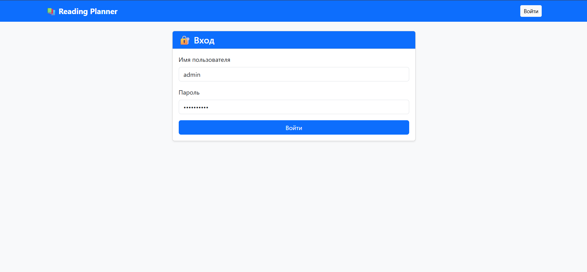
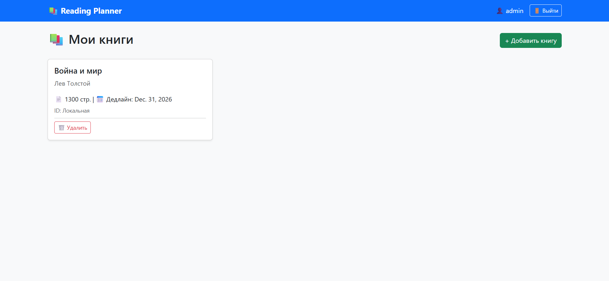
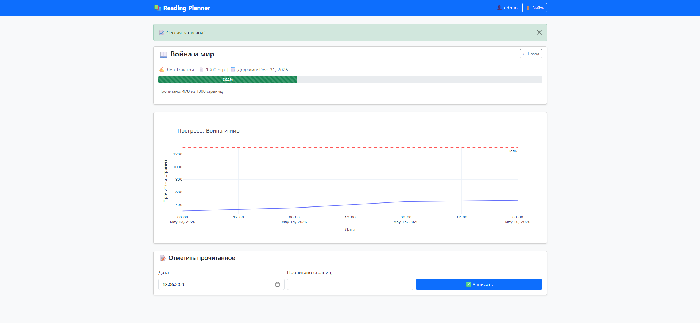

# 📚 Reading Planner

Планировщик чтения и аналитики прогресса освоения литературы для студентов.  
Система помогает равномерно распределить нагрузку, отслеживать сессии чтения и визуализировать результаты с помощью интерактивных графиков.

 **Демо:** [https://bureap.pythonanywhere.com/](https://bureap.pythonanywhere.com/)  
👤 **Логин/Пароль для теста:** `admin` / `1!2@3#4$5%` 

---

## 🛠 Технологии

| Слой | Стек |
|------|------|
| **Backend** | Python 3.14, Django 4.2 |
| **База данных** | SQLite (dev) / PostgreSQL (prod-ready) |
| **Аналитика** | Pandas, NumPy |
| **Визуализация** | Plotly (интерактивные графики) |
| **Frontend** | HTML5, Bootstrap 5, Jinja2 Templates |
| **API** | Google Books API (автозаполнение метаданных) |
| **Деплой** | PythonAnywhere, Git |

---

## 📋 Функционал

✅ Регистрация и авторизация пользователей  
✅ Добавление книг с автоподтягиванием данных из API  
✅ Ведение дневника чтения (дата + кол-во страниц)  
✅ Расчёт прогресса в реальном времени (% и прогресс-бар)  
✅ Интерактивные графики темпа чтения (Plotly + Pandas)  
✅ Управление книгами (просмотр, редактирование, удаление)  
✅ Адаптивный дизайн (Bootstrap 5)

---

## 📸 Скриншоты

### Авторизация


### Список книг


### Аналитика и графики


---

## 🚀 Запуск проекта

### 1. Клонирование и окружение
```bash
git clone https://github.com/BLUREAP/reading_planner.git
cd reading_planner
python -m venv venv
venv\Scripts\activate  # Windows